# Blazium Game Checklist

A checklist of things needed to do when releasing a game. Copy paste the following below in a game repo to have the checklist.

NOTE: For all pages, also add where possible either videos or gif files (eg. steam supports gif files in description, appstore/play store support video files)

1. [Stores](#1-stores)
2. [Documentation](#2-documentation)
3. [Localization](#3-localization)
4. [Image Sizes](#4-image-sizes)
5. [Languages Supported](#5-languages-supported)

## 1. Stores

Update all stores with the game.

- [ ] [Steam Page](#steam-page) (2 weeks in advance)
- [ ] [Google Play Page](#google-play-page)
- [ ] [App Store Pages](#app-store-pages)
- [ ] [Discord Page](#discord-page)
- [ ] [POGR Page](#pogr-page)

### Steam Page

[Steamworls URL](https://partner.steamgames.com/?ref=stebet.net)

1. Create App Page.
2. Create Depot for each platform.
3. Update the steam page with info and images about the game.
4. Set the build live.
5. Release the page.

### Google Play Page

[Google Developer URL](https://developer.android.com/distribute/console)

1. Create App Page.
2. Manually create an internal release first time (download latest build and upload it using play developer website): Test and Release -> Testing -> Internal Testing
3. Update with info and images about the game.
4. Create new Internal Release and test it.
4. Publish the release to Production.

### App Store Pages

[Apple Developer URL](https://developer.apple.com)

1. Create Identifier.
2. Create Profiles: macos and ios distribution.
3. Create App Page.
4. Update with info and images about the game.
5. Set Build with latest build.
6. Submit for Review.

### Discord Page

[Discord Developer URL](https://discord.com/developers/docs/intro)

1. Create Application.
2. Update all settings, descriptions and images.

### POGR Page

[POGR Developer Page](https://pogr.io)

1. Create Application
2. Copy Client and Build ID in the game
3. Create Widgets
4. Update Application Page

## 2. Documentation

Create documentation for the game. This can be posted in multiple places.

- [ ] [Article](#article)
- [ ] [Main Website](#main-website)

### Article

Draft an article about the game, with the following structure:

- Title
- Summary
- Content (at least 3-4 images/gifs): Structure it into 3-4 chapters also.

## 3. Localization

Make sure the game and shared menus are localized.

1. Localize if you are using from shared menus `settings_extra` or `menu_persona`.
2. Localize the in game buttons and texts, including server messages.

### Main Website

1. Update the main website with info and images about the game.

## 4. Image Sizes

### Apple

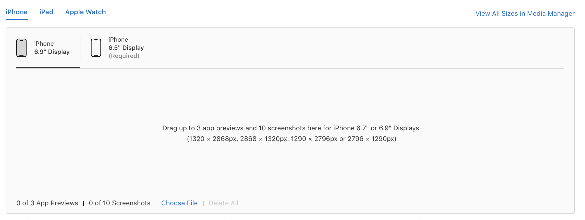

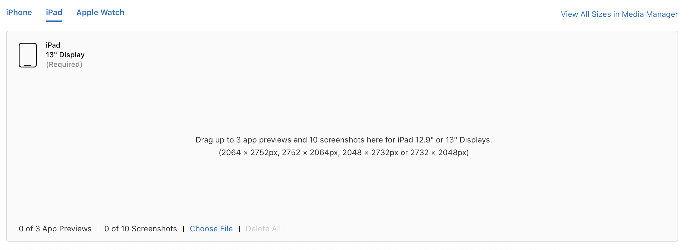

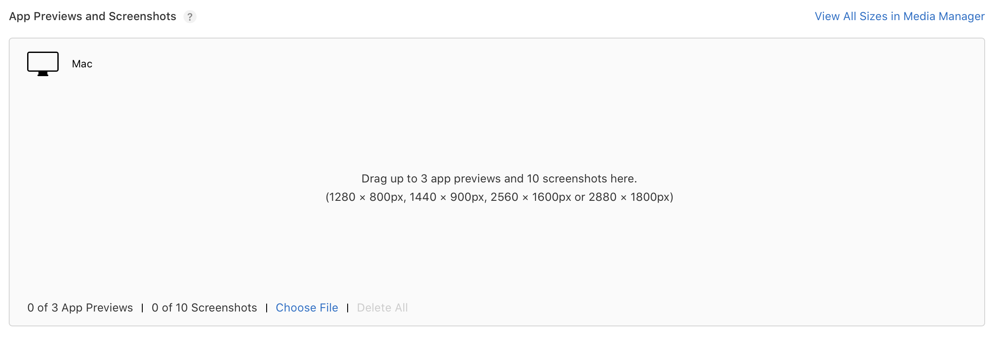

### Discord

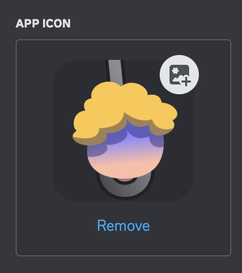
1024 or 512

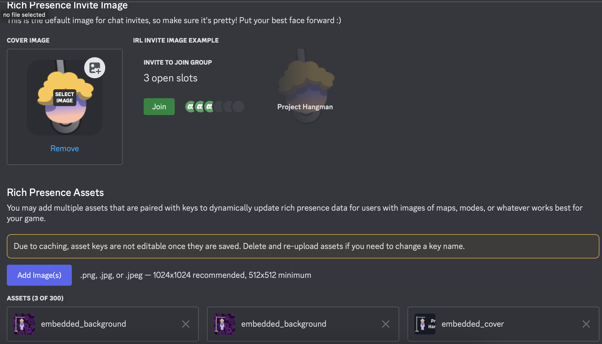

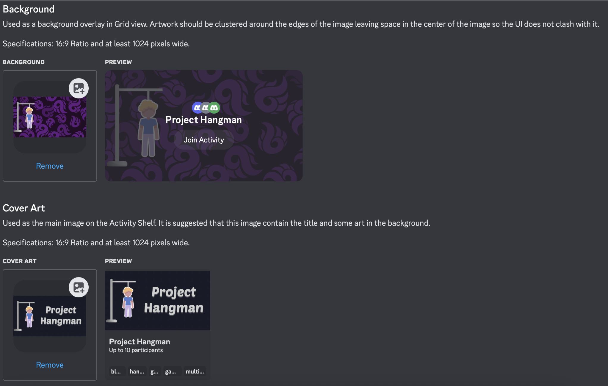

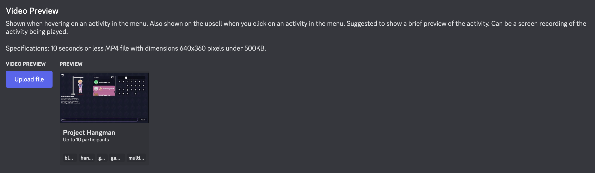

### Google

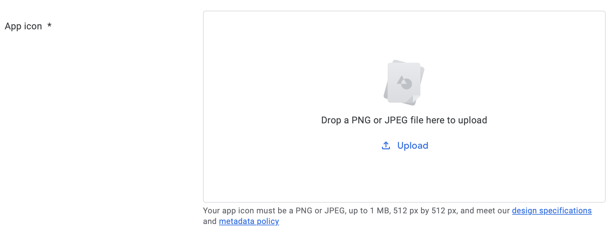

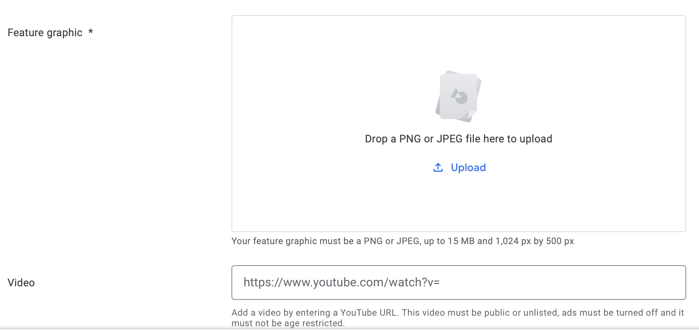

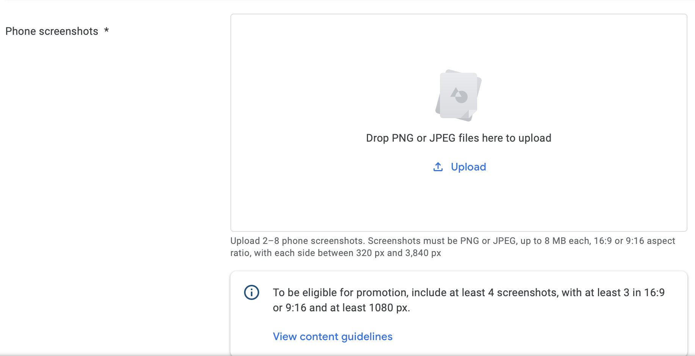

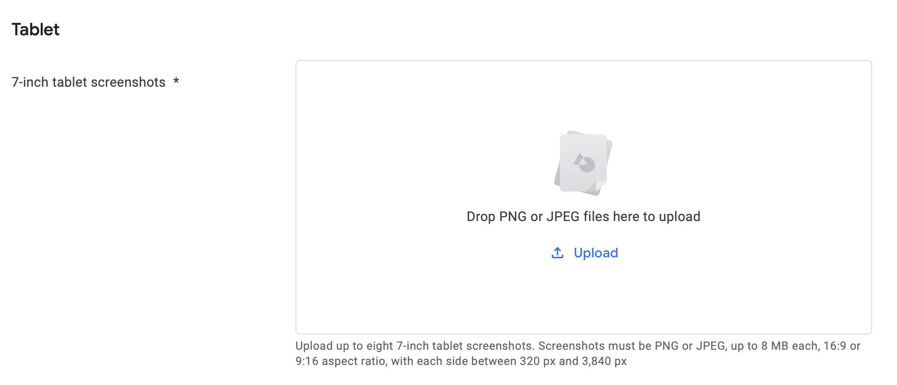

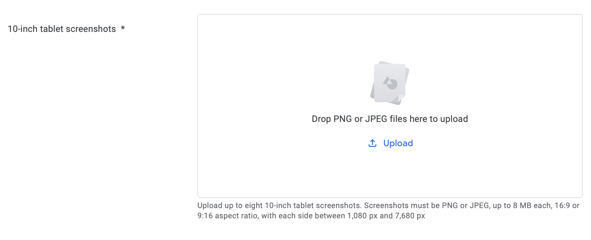

### Steam

- Store assets

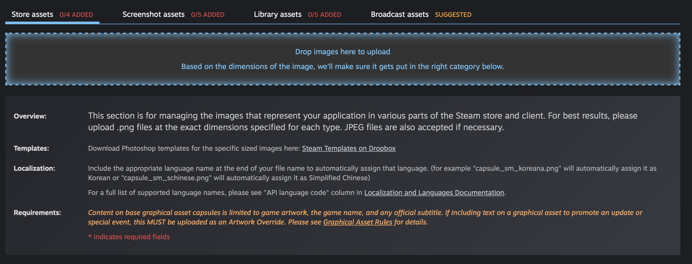

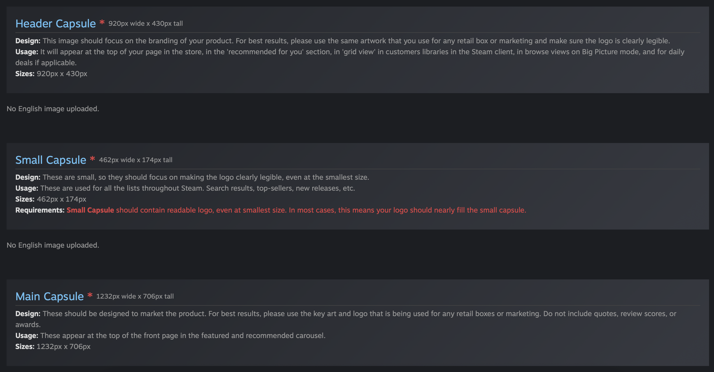

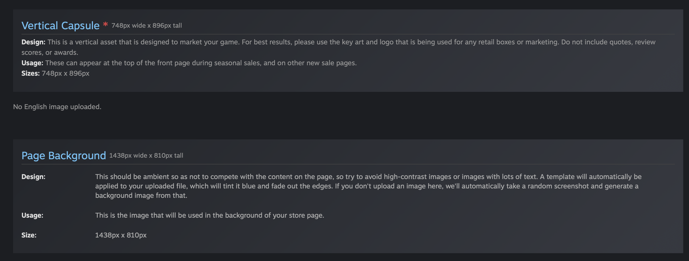

- Screenshots

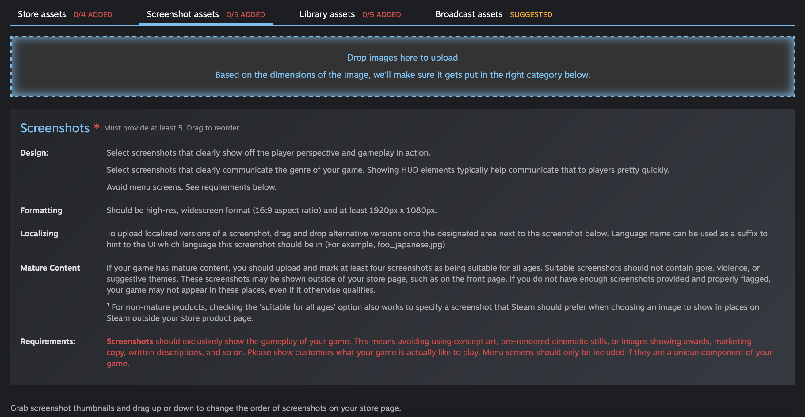

- Library Assets

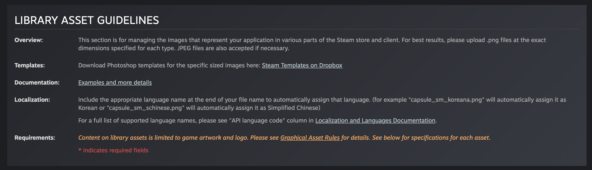

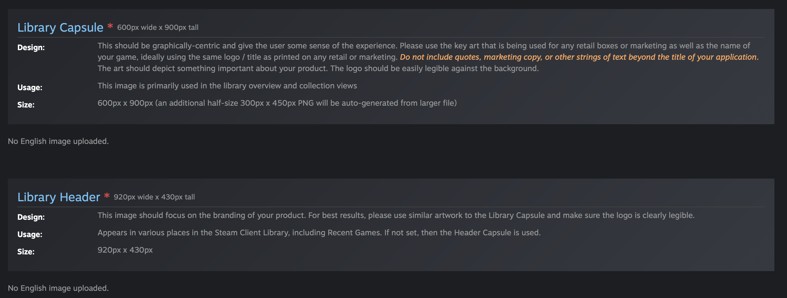

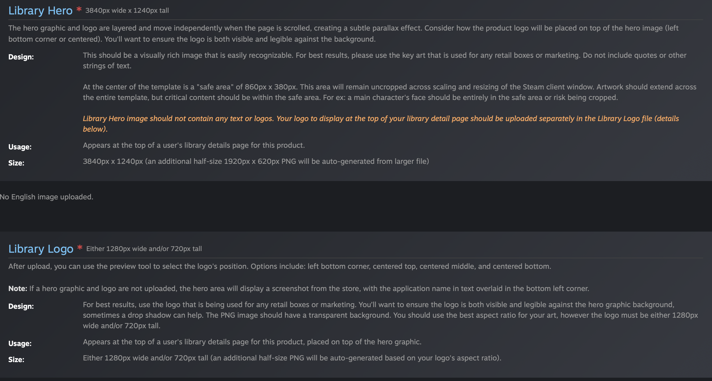

### Article

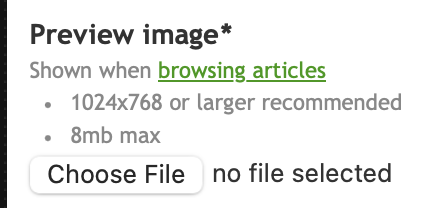

## 5. Languages Supported

Our games support all the main languages that steam supports:

Language Name| Native Name| Short Name| Code
-|-|-|-
Arabic | العربية | arabic | ar
Bulgarian | български език | bulgarian | bg
Chinese (Simplified) | 简体中文 | schinese | zh-CN
Chinese (Traditional) | 繁體中文 | tchinese | zh-TW
Czech | čeština | czech | cs
Danish | Dansk | danish | da
Dutch | Nederlands | dutch | nl
English | English | english | en
Finnish | Suomi | finnish | fi
French | Français | french | fr
German | Deutsch | german | de
Greek | Ελληνικά | greek | el
Hungarian | Magyar | hungarian | hu
Indonesian | Bahasa Indonesia | indonesian | id
Italian | Italiano | italian | it
Japanese | 日本語 | japanese | ja
Korean | 한국어 | koreana | ko
Norwegian | Norsk | norwegian | no
Polish | Polski | polish | pl
Portuguese | Português | portuguese | pt
Portuguese-Brazil | Português-Brasil | brazilian | pt-BR
Romanian | Română | romanian | ro
Russian | Русский | russian | ru
Spanish-Spain | Español-España | spanish | es
Spanish-Latin America | Español-Latinoamérica | latam | es-419
Swedish | Svenska | swedish | sv
Thai | ไทย | thai | th
Turkish | Türkçe | turkish | tr
Ukrainian | Українська | ukrainian | uk
Vietnamese | Tiếng Việt | vietnamese | vi
